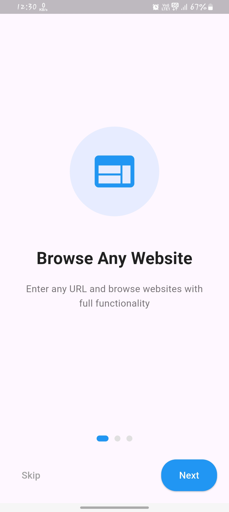
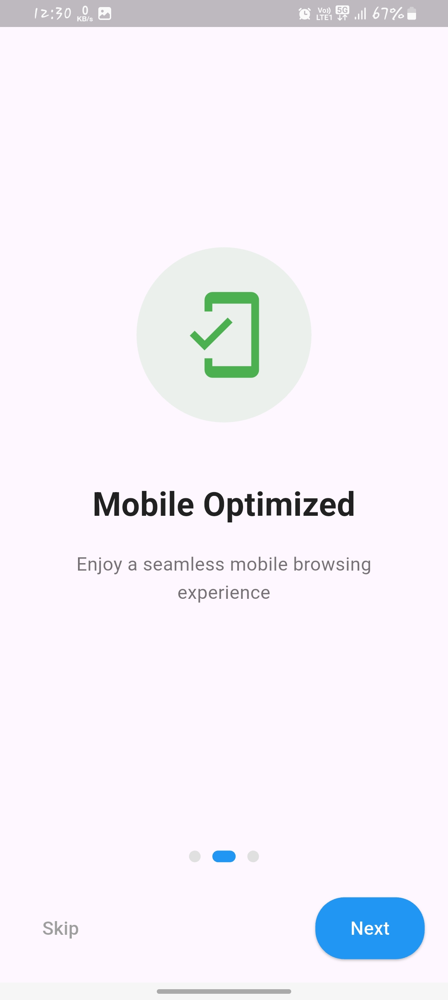
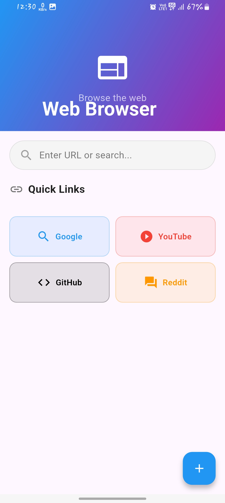
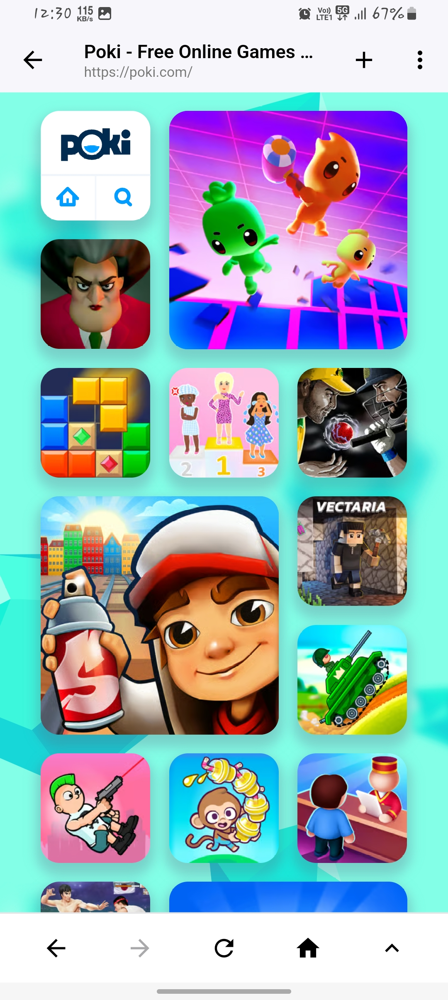

# 🌐 WebNest – Wrap Any Website in a Native App Shell

WebNest is a lightweight and developer-friendly Flutter app that lets users enter any website URL and interact with it in a full-featured WebView container — complete with a splash screen, onboarding experience, and PWA-ready support. Perfect for showcasing responsive websites, testing PWAs, or creating instant mobile demos!

---

## 📱 Features

- 🚀 **Splash Screen** – Branded launch screen with logo
- 🧭 **Onboarding Screens** – Explain the app flow and usage (3-4 slides)
- 🔗 **URL Input Page** – Enter any HTTP/HTTPS URL
- 🌐 **WebView Container** – Full JavaScript, DOM, BOM support
- ❌ **Reset/Remove URL Button** – Return to input screen anytime
- 📦 **PWA-Ready** – Build and install on the web or mobile browsers

---

## 📸 Screenshots

| Onboarding1 | Onboarding2 |Onboarding3 | URL Input | WebView Loaded |
|-------|------------|-----------|----------------|
|  |  | |  |  |

> 📌 Images should be placed in `assets/screens/`. Replace the placeholders with actual screenshots of your app.

---

## 🚀 Getting Started

### 1. Clone the Repo

```bash
git clone https://github.com/MihirParmar011/webnest.git
cd webnest
```

### 2. Install Dependencies

```bash
flutter pub get
```

### 3. Run the App

```bash
flutter run
```

### 4. Build for Web (PWA)

```bash
flutter build web
```

Deploy the `build/web/` folder to any static web host like Firebase, Vercel, or Netlify.

---

## 🗂️ Folder Structure

```
webnest/
├── lib/
│   ├── main.dart
│   ├── splash_screen.dart
│   ├── onboarding_screen.dart
│   ├── url_input_screen.dart
│   └── webview_screen.dart
├── assets/
│   ├── images/
│   └── screens/
├── web/
│   ├── manifest.json
│   └── index.html
└── pubspec.yaml
```

---

## 🧠 Use Cases

- ✅ Freelancers showing responsive web projects
- ✅ Startups demoing MVPs without full app development
- ✅ Developers testing PWAs in a mobile container
- ✅ Quick wrapper for personal/internal use apps
- ✅ Branded app showcase for clients or investors

---

## 📦 Packages Used

- `webview_flutter` - For WebView functionality
- `shared_preferences` - For storing user preferences *(optional)*
- `flutter_onboarding` - For onboarding screens *(or custom implementation)*

---

## 🔐 Security Note

Always use HTTPS URLs. You can implement URL whitelisting or disable JavaScript for untrusted sources if needed.

---

## 👨‍💻 Author

**Mihir Parmar**

📧 Email: mihir.parmar11.01@gmail.com  
🔗 [LinkedIn](https://linkedin.com/in/mihirparmar)  
💻 [GitHub](https://github.com/mihirparmar)

---

## 📄 License

This project is licensed under the MIT License - see the [LICENSE](LICENSE) file for details.

---

## ⭐ Like the Project?

If you find WebNest useful, please consider:
- Giving a ⭐ on GitHub
- Sharing it with others
- Contributing to the project
- Reporting issues or suggesting features

---

## 🤝 Contributing

Contributions are welcome! Please feel free to submit a Pull Request. For major changes, please open an issue first to discuss what you would like to change.

1. Fork the Project
2. Create your Feature Branch (`git checkout -b feature/AmazingFeature`)
3. Commit your Changes (`git commit -m 'Add some AmazingFeature'`)
4. Push to the Branch (`git push origin feature/AmazingFeature`)
5. Open a Pull Request

---

## 📞 Support

If you have any questions or need help, feel free to:
- Open an issue on GitHub
- Contact me via email
- Connect with me on LinkedIn

---

<div align="center">
  Made with ❤️ by Mihir Parmar
</div>